**movy.js** is an easy-to-use animation engine based on three.js and gsap.

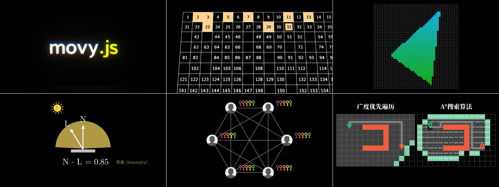

## Getting Started

Make sure you have [node.js (version >= 12)](https://nodejs.org/en/download/) installed on your computer.

You can install **movy.js** simply by:

```sh
npm i -g movy
```

To run **movy.js**, enter the following command in your terminal:

```sh
movy
```

It will show a list of example animations in the `examples` folder.

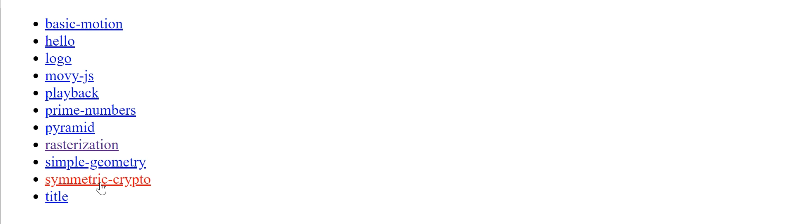

To create your own animation, you can start a new javascript file. Following is a simple hello-world example:

```js
import * as mo from "movy";

const t = mo
  .addText("movy.js is simple!", {
    scale: 1,
    color: "yellow",
  })
  .reveal();

mo.run(); // Should call this method at the end!!!
```

Save the file as `hello.js`. To open the animation in the browser, you can

```sh
movy hello.js
```

> Note that changing the source code will automatically refresh the browser content.

## Add objects into the scene

To add new objects into the scene, you can use `mo.add___()` methods. For example:

| Method             | Comment        | Preview                   |
| ------------------ | -------------- | ------------------------- |
| `mo.addCircle()`   | Add a circle   | 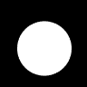   |
| `mo.addRect()`     | Add a rect     | 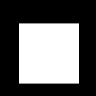     |
| `mo.addTriangle()` | Add a triangle | 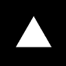 |
| ...                | ...            | ...                       |

### Customize objects

All methods above can take **extra** named arguments for object customization. For example, to set the object color, you can use

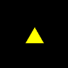

```
mo.addTriangle({ color: "yellow", scale: 0.5 });
```

This will create a half-size yellow triangle.

Furthermore, you can pass

<table>
<thead>
<tr>
<th>Methods</th>
<th>Comment</th>
<th>Preview</th>
</tr>
</thead>
<tbody>

<tr>
<td><pre><code>mo.addCircle({
  x: 0.5, 
  y: 0.2
})</code></pre></td>
<td>Set X and Y coordinates to be <code>(0.5, 0.2)</code>. Note that movy.js uses Cartesian coordinates for 2D objects (y-axis pointing upwards).</td>
<td>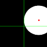</td>
</tr>

<tr>
<td><pre><code>mo.addCircle({ 
  position: [0.1, 0.2, 0] 
})</code></pre></td>
<td><code>position</code> specifies the circle coordinates similar to <code>x</code>, <code>y</code>, <code>z</code> parameters. However it takes an array of numbers.</td>
<td></td>
</tr>

<tr>
<td><pre><code>mo.addRect({
  rz: 0.25 * Math.PI,
});</code></pre></td>
<td>Rotate the rect along the Z axis by π/4.</td>
<td>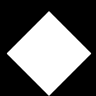</td>
</tr>

<tr>
<td><pre><code>mo.addRect({
  rx: 0.5,
  ry: 1
})</code></pre></td>
<td>Note that movy.js internally uses 3D coordinates. You can also rotate any 2D object along X and Y axis by <code>rx</code> and <code>ry</code> parameters.</td>
<td></td>
</tr>

<tr>
<td><pre><code>mo.addCircle({
  scale: 0.5,
})</code></pre></td>
<td>Scale the circle by <code>0.5</code> (half size).</td>
<td>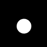</td>
</tr>

<tr>
<td><pre><code>mo.addCircle({
  sx: 1.5,
  sy: 0.5
})</code></pre></td>
<td>Create an ellipse by scaling along X and Y axis differently.</td>
<td>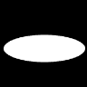</td>
</tr>

<tr>
<td><pre><code>mo.addCircle({
  color: "#3498db"
})</code></pre></td>
<td>You can pass hex code, e.g. <code>"#3498db"</code> to specify object color. Alternatively, you can use X11 color name, e.g. <code>"blue"</code>.</td>
<td>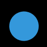</td>
</tr>

</tbody>
</table>

### More shapes

Besides, you can use `mo.add___Outline()` methods to create outlined shapes. For example:

| Method                    | Comment               | Preview                       |
| ------------------------- | --------------------- | ----------------------------- |
| `mo.addCircleOutline()`   | Add circle outline.   | 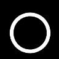   |
| `mo.addRectOutline()`     | Add rect outline.     | 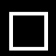     |
| `mo.addTriangleOutline()` | Add triangle outline. | 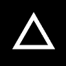 |
| ...                       | ...                   | ...                           |

All named arguments mentioned in the previous section still works for these outlined shapes. Moreover, you can pass

<table>
<thead>
<tr>
<th>Methods</th>
<th>Comment</th>
<th>Preview</th>
</tr>
</thead>
<tbody>

<tr>
<td><pre><code>mo.addCircleOutline({
  lineWidth: 0.3,
})</code></pre></td>
<td>Set the line width of the circle outline to <code>0.3</code>.</td>
<td></td>
</tr>

<tr>
<td><pre><code>mo.addRectOutline({
  width: 1.5,
  height: 1,
})</code></pre></td>
<td>Instead of <code>sx</code> and <code>sy</code> to scale a shape, you can alternatively use <code>width</code> and <code>height</code> to specify the size of a shape. This method will not scale the line strokes unevenly.</td>
<td>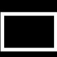</td>
</tr>

</tbody>
</table>

### Add animations

For each added scene object, you can call, e.g. `obj.fadeIn()`, `obj.reveal()`, `obj.grow()`, etc. to add different animations.

```
const rect = mo.addRect();

rect.grow();  // This will add grow animation to the circle object.
```

The following table lists the common animations supported by `movy.js`.

<table>
<thead>

<tr>
<td><pre><code>rect.fadeIn()</code></pre></td>
<td>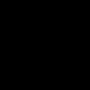</td>
<td><pre><code>rect.wipeIn()</code></pre></td>
<td></td>
</tr>

<tr>
<td><pre><code>rect.grow()</code></pre></td>
<td></td>
<td><pre><code>rect.rotateIn()</code></pre></td>
<td>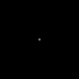</td>
</tr>

<tr>
<td><pre><code>rect.reveal()</code></pre></td>
<td></td>
<td><pre><code>rect.shake2D()</code></pre></td>
<td>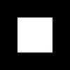</td>
</tr>

</tbody>
</table>

#### Customize animations

All animations can take following parameters for customization.

<table>
<thead>
<tr>
<td><pre><code>rect.fadeIn({t: 1})</code></pre></td>
<td><code>t</code> parameter specifies when the animation should be started. For example, <code>t: 1</code> specifies that the animation should start at 1 second. <code>t: '<'</code> specifies that the animation should begin at the same time of the previous animation. <code>t: '+=1'</code> specifies that the animation should starts 1 second after all previous animations finish. <br/><code>movy.js</code> internally uses <code>gsap</code>. For more information, please refer to <a href="https://greensock.com/position-parameter/">Understanding the Position Parameter</a>.</td>
</tr>
<tr>
<td><pre><code>rect.fadeIn({duration: 2})</code></pre></td>
<td>Set the animation duration to <code>2</code> seconds.</td>
</tr>
<tr>
<td><pre><code>rect.fadeIn({ease: 'linear'})</code></pre></td>
<td><code>ease</code> parameter specifies the easing curve used for the animation. Different animations are pre-configured with different default easing functions. However, you can overwrite this to completely change the nature of your animation. For more information, please refer to <a href="https://greensock.com/docs/v3/Eases">gsap / Eases</a></td>
</tr>
</tbody>
</table>

Note that some animation can take **extra parameters**. For example, you can pass `{ direction: 'down' }` in `obj.reveal()` to specify the direction from which the object reveals.

#### Combining animations


By combining existing animations with some parameter tweaking, we can derive more complicated and beautiful animations.

```
mo.addRectOutline()
  .reveal()
  .moveTo({ rz: Math.PI * 4, duration: 2 })
  .fadeOut();
```
